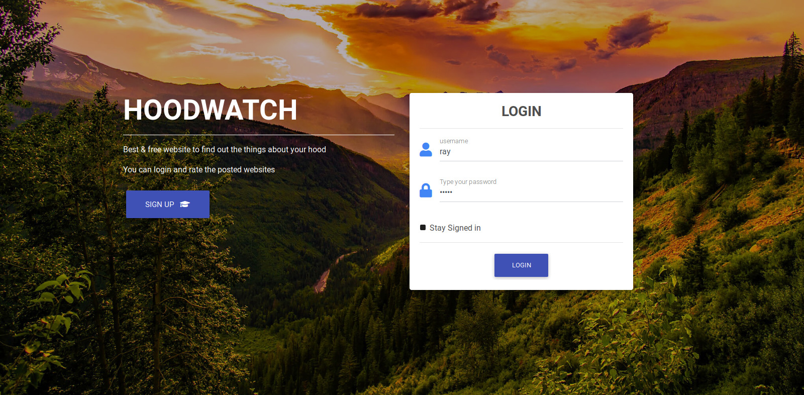

# Neighborhood
> Checkout my neighborhood application

<!-- #### This is my personal gallery website where you can see photos that i have uploaded. -->


## As users you can :
* Login and post about your hood                             
* View different hoods that interest you.
* You can leave a comment on the hood.
<!-- * Click on a single photo to expand it and view the details of the photo. -->
<!-- * Copy a link to the photo to share with my friends.
* Search a photo . -->

## Usage example

1. Open the website and login.
2. If you see your hood is missing please add it.


## Development setup

To access the Code behind this site, you will need to:

1. Clone this repo:
  ```bash
  git clone https://github.com/raymondyegon/neighboorhood
  ```
2. Move to the folder and install requirements
  ```bash
  cd neighboorhood
  pip install -r requirements.txt
  ```
3. Create database on psql shell
  ```SQL
  psql
  CREATE DATABASE hood;
  ```
4. Migrate the database and run the application
  ```bash
  python manage.py migrate
  python manage.py runserver
  ```

## Technologies Used
* python3
* Django
* Jinja
* HTML
* css
* Materialize
* Bootstrap

## Known Bugs.
* There are currently no known bugs. If you experience any feel free to open an issue

### Support and contact details
If you have any queries regarding the my site,
Please feel free to contact on [gmail](mailto://raymondyegon17@gmail.com) and we will be happy to look into your query

## Licensing
###### This Project is under the MIT License 2019
  